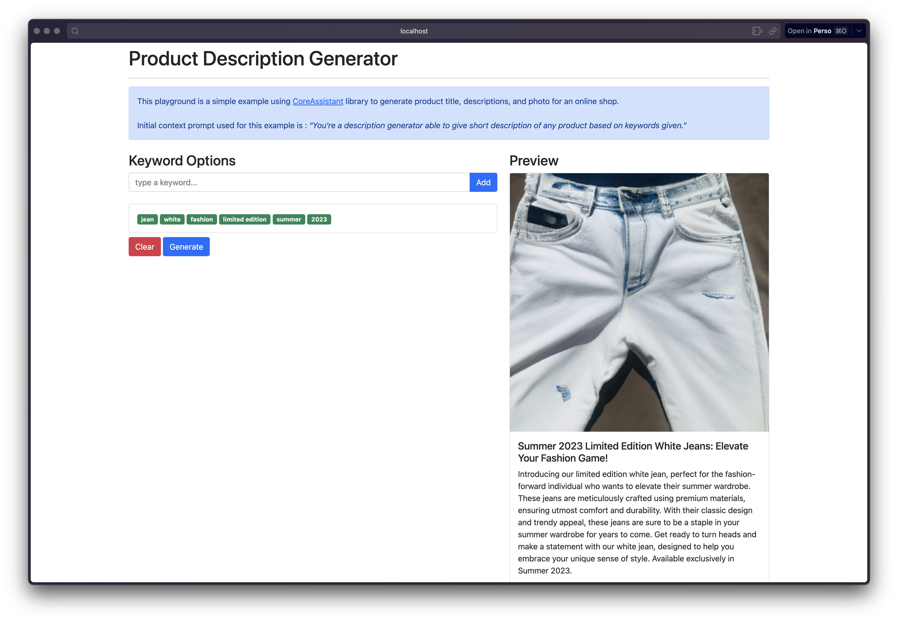

# CoreAssistant 
A simple library enabling the power of [ChatGPT](https://chat.openai.com) in your application.

The library is in active development, stay connected to get new features!

[](https://github.com/GurYN/CoreAssistant/actions/workflows/build-library.yml)

# Playground examples
Small app examples are provided to test the library :

## [ConsoleChat](playground/ConsoleChat)
A simple console app allowing you to interact in a chat mode


To test ConsoleChat example:
```bash
cd playground
cd ConsoleChat

dotnet restore
dotnet run
```

## [SmartShop](playground/SmartShop)
A web app allowing you to generate description of a product based on keywords


To test SmartShop example:

1/ Duplicate the [appsettings.json](playground/SmartShop/appsettings.json) file and rename it as `appsettings.Development.json`

2/ Update the parameter `ApiKey` in the new file created with your OpenAI Api key

3/ Launch the app
```bash
cd playground
cd SmartShop

dotnet restore
dotnet run

# open your browser to the url displayed
```

# Install the library
Library will be published on nuget.org in a near future. In the meantime, you can install the library like this :

## 1/ Build and publish your library :
```bash
# Go to the library path
cd src

# Restore dependencies
dotnet restore

# Build library
dotnet build

# Publish library to "output" folder
dotnet publish -c Release -o output
```

## 2/ Reference the library
Add the library (CoreAssistant.dll) in your .csproj project

```xml
<ItemGroup>
  <Reference Include="CoreAssistant">
    <HintPath>path\to\CoreAssistant.dll</HintPath>
  </Reference>
</ItemGroup>
```

# Quick Start
You can use the library directly or using dependency injection.

## 1/ Using directly
```csharp
using CoreAssistant;

...

var options = new CoreAssistantOptions("YOUR OPENAI API KEY");
var assistant = new Assistant(options);

var question = new Question("You question");
var answer = await assistant.AskForSomething(question);

Console.WriteLine(answer.Content);
```

## 2/ Using dependency injection
In your Program.cs :

```csharp
using CoreAssistant.Extensions;

...

builder.Services.AddCoreAssistant(options => { 
    options.ApiKey = "YOU OPENAI API KEY"
});
```
__Warning__ : Do not store your API key in source code. Use `appsettings.json` instead.

In a class of your project :
```csharp
using CoreAssistant;

public class ClassName
{
    private readonly Assistant _assistant;

    public ClassName(Assistant assistant)
    {
        _assistant = assistant;
    }

    public async Task<string> GetAnswer(string query)
    {
        var question = new Question(query);
        var answer = await _assistant.AskForSomething(question);

        return answer.Content;
    }
}
````

# Advanced use
## History context
The library will keep the conversation history during the lifecycle of your CoreAssistant instance. You can then ask any question and get answers based on the entire history (like ChatGPT website).

## Default Context
You can define a default context to specialize the answers of your assistant. To do so, just add the default context in your `CoreAssistantOptions` object. 

Ex:
```csharp
var options = 
    new CoreAssistantOptions("YOUR OPENAI API KEY") {
        DefaultContext = "YOUR DEFAULT CONTEXT"
    };
```

## Async vs Stream
You can use async or stream method to receive an answer. To do so, just call the right method based on your desired result.

Ex:
```csharp
using CoreAssistant;

...

var options = new CoreAssistantOptions("YOUR OPENAI API KEY");
var assistant = new Assistant(options);
var question = new Question("You question");

# Async call
var answer = await assistant.AskForSomething(question);
Console.WriteLine(answer.Content);

# Stream call
var stream = assistant.AskForSomethingAsStream(question);
await foreach (var item in stream)
{
    Console.Write(item.Content);
}
```

## GPT Model
You can define the GPT model used by the library. To do so, set it when calling `AskForSomething()` or `AskForSomethingAsStream()` method.

__Note__: GPT-4 model access is restricted, join the [waiting list](https://openai.com/waitlist/gpt-4-api) to access it.

Ex:
```csharp
using CoreAssistant;

...

var question = new Question("You question");

# Async call
var answer = await assistant.AskForSomething(question, AssistantModel.GPT3_5);

# Stream call
var stream = assistant.AskForSomethingAsStream(question, AssistantModel.GPT4);
```
